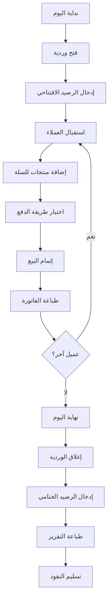

# 📱 نظام نقاط البيع (POS) - دليل سريع

## ✅ ما تم إنجازه

### 1. المسارات (Routes)
تم إضافة المسارات التالية في `app/pos/routes.py`:

- ✅ `/pos/` - واجهة البيع الرئيسية
- ✅ `/pos/open-session` - فتح وردية جديدة
- ✅ `/pos/close-session/<id>` - إغلاق وردية
- ✅ `/pos/sessions` - قائمة الورديات
- ✅ `/pos/session/<id>` - تفاصيل الوردية
- ✅ `/pos/create-order` - إنشاء طلب جديد (API)
- ✅ `/pos/print-receipt/<order_id>` - طباعة فاتورة
- ✅ `/pos/print-session-report/<id>` - طباعة تقرير الوردية

### 2. الواجهات (Templates)
تم إنشاء الواجهات التالية في `app/templates/pos/`:

- ✅ `open_session.html` - فتح وردية جديدة
- ✅ `index.html` - واجهة البيع التفاعلية
- ✅ `sessions.html` - قائمة الورديات
- ✅ `session_details.html` - تفاصيل الوردية
- ✅ `receipt.html` - فاتورة البيع (للطباعة)
- ✅ `session_report.html` - تقرير الوردية (للطباعة)

### 3. الوظائف الرئيسية

#### إدارة الورديات ✅
- [x] فتح وردية جديدة
- [x] تسجيل الرصيد الافتتاحي
- [x] إغلاق الوردية
- [x] تسجيل الرصيد الختامي
- [x] حساب تلقائي للمبيعات
- [x] تتبع المبيعات النقدية والبطاقات
- [x] عرض قائمة الورديات
- [x] تفاصيل كاملة لكل وردية

#### واجهة البيع ✅
- [x] عرض المنتجات بشكل مرئي
- [x] بحث سريع (اسم، كود، باركود)
- [x] إضافة منتجات للسلة
- [x] تعديل الكميات
- [x] حذف من السلة
- [x] اختيار العميل (اختياري)
- [x] إضافة خصم
- [x] حساب تلقائي للضرائب

#### طرق الدفع ✅
- [x] دفع نقدي
- [x] دفع بالبطاقة
- [x] دفع مختلط (نقدي + بطاقة)
- [x] حساب الباقي تلقائياً

#### إدارة المخزون ✅
- [x] خصم تلقائي من المخزون عند البيع
- [x] تسجيل حركات المخزون
- [x] ربط بالمستودعات
- [x] عرض الكميات المتوفرة

#### الطباعة والتقارير ✅
- [x] طباعة فاتورة البيع
- [x] طباعة تقرير الوردية
- [x] ملخص مالي مفصل
- [x] قائمة الطلبات

### 4. المميزات الإضافية ✅
- [x] واجهة عربية كاملة
- [x] تصميم متجاوب (Bootstrap 5)
- [x] JavaScript للحسابات التلقائية
- [x] اختصارات لوحة المفاتيح (F1, F2, F3, ESC)
- [x] بحث فوري في المنتجات
- [x] عرض الوقت الحالي
- [x] تعليق الطلبات (Hold Orders)
- [x] مسح السلة
- [x] قائمة منسدلة في القائمة الرئيسية

---

## 🚀 البدء السريع

### 1. فتح وردية
```
1. اذهب إلى: نقاط البيع > فتح وردية جديدة
2. اختر المستودع
3. أدخل الرصيد الافتتاحي
4. اضغط "فتح الوردية"
```

### 2. إتمام عملية بيع
```
1. ابحث عن المنتج أو اضغط على بطاقته
2. عدل الكمية إذا لزم الأمر
3. أضف خصم (اختياري)
4. اختر طريقة الدفع
5. اضغط "إتمام البيع" (F2)
6. اطبع الفاتورة
```

### 3. إغلاق الوردية
```
1. اضغط "إغلاق الوردية"
2. أدخل الرصيد الختامي
3. تأكيد الإغلاق
4. اطبع التقرير
```

---

## 📊 الحسابات التلقائية

```javascript
المجموع الفرعي = مجموع (السعر × الكمية)
مبلغ الخصم = المجموع الفرعي × (نسبة الخصم ÷ 100)
المبلغ بعد الخصم = المجموع الفرعي - مبلغ الخصم
الضريبة (15%) = المبلغ بعد الخصم × 0.15
الإجمالي = المبلغ بعد الخصم + الضريبة
```

---

## ⌨️ اختصارات لوحة المفاتيح

| المفتاح | الوظيفة |
|---------|---------|
| **F1** | الانتقال لحقل البحث |
| **F2** | إتمام البيع |
| **F3** | مسح السلة |
| **ESC** | مسح البحث |

---

## 📁 هيكل الملفات

```
DED/
├── app/
│   ├── pos/
│   │   ├── __init__.py
│   │   └── routes.py                    ✅ محدّث
│   ├── templates/
│   │   └── pos/                         ✅ جديد
│   │       ├── open_session.html
│   │       ├── index.html
│   │       ├── sessions.html
│   │       ├── session_details.html
│   │       ├── receipt.html
│   │       └── session_report.html
│   ├── models_pos.py                    ✅ موجود مسبقاً
│   └── templates/base.html              ✅ محدّث
├── POS_DOCUMENTATION.md                 ✅ جديد
├── POS_README.md                        ✅ جديد
└── POS_DEVELOPER_GUIDE.md               ✅ سيتم إنشاؤه
```

---

## 🎯 النماذج المستخدمة

### POSSession (الوردية)
```python
- session_number: رقم الوردية
- cashier_id: الكاشير
- warehouse_id: المستودع
- opening_time: وقت الفتح
- closing_time: وقت الإغلاق
- opening_balance: الرصيد الافتتاحي
- closing_balance: الرصيد الختامي
- total_sales: إجمالي المبيعات
- total_cash: المبيعات النقدية
- total_card: المبيعات بالبطاقة
- status: الحالة (open/closed)
```

### POSOrder (الطلب)
```python
- order_number: رقم الطلب
- session_id: الوردية
- customer_id: العميل (اختياري)
- subtotal: المجموع الفرعي
- discount_amount: مبلغ الخصم
- tax_amount: الضريبة
- total_amount: الإجمالي
- payment_method: طريقة الدفع
- cash_amount: المبلغ النقدي
- card_amount: مبلغ البطاقة
- change_amount: الباقي
- status: الحالة
```

### POSOrderItem (عنصر الطلب)
```python
- order_id: الطلب
- product_id: المنتج
- quantity: الكمية
- unit_price: سعر الوحدة
- total: الإجمالي
```

---

## 🔄 سير العمل



---

## 💡 نصائح سريعة

### للكاشير:
1. ✅ تحقق من الرصيد الافتتاحي بدقة
2. ✅ راجع المنتجات مع العميل قبل الدفع
3. ✅ استخدم اختصارات لوحة المفاتيح للسرعة
4. ✅ اطبع الفاتورة دائماً
5. ✅ عد النقود بدقة عند الإغلاق

### للمدير:
1. ✅ راجع تقارير الورديات يومياً
2. ✅ تحقق من الفروقات في الأرصدة
3. ✅ درب الكاشيرات على النظام
4. ✅ احتفظ بنسخ احتياطية من التقارير

---

## ❓ أسئلة شائعة

**س: هل يمكن البيع بدون فتح وردية؟**  
ج: لا، يجب فتح وردية أولاً.

**س: هل يتم خصم المخزون تلقائياً؟**  
ج: نعم، عند إتمام البيع.

**س: كيف أطبع فاتورة سابقة؟**  
ج: من تفاصيل الوردية، يمكنك الوصول لجميع الطلبات.

**س: ماذا لو كان هناك فرق في الرصيد؟**  
ج: سجل الرصيد الفعلي، وسيظهر الفرق في التقرير.

---

## 📚 مراجع إضافية

- **POS_DOCUMENTATION.md** - دليل شامل ومفصل
- **POS_DEVELOPER_GUIDE.md** - دليل المطور
- **DATABASE_SCHEMA.md** - هيكل قاعدة البيانات
- **MODELS.md** - شرح النماذج

---

## ✨ الخلاصة

**نظام نقاط البيع جاهز للاستخدام!** 🎉

- ✅ 8 مسارات
- ✅ 6 واجهات
- ✅ جميع الوظائف الأساسية
- ✅ ربط تلقائي بالمخزون
- ✅ تقارير مفصلة
- ✅ واجهة سريعة وسهلة

---

**تم بحمد الله**  
**التاريخ**: 2026-01-10  
**الإصدار**: 1.0

