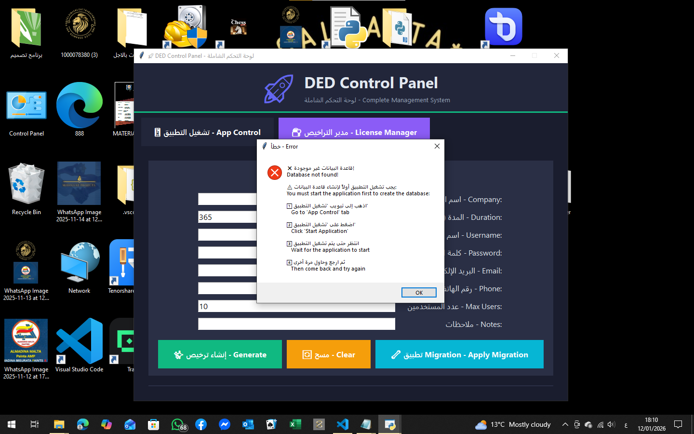

# 📋 دليل نظام التراخيص - License System Guide

## 🚀 البدء السريع - Quick Start

### الخطوة 1: تشغيل التطبيق
**Step 1: Start the Application**

1. افتح لوحة التحكم `DED_Control_Panel.pyw`
   - Open the Control Panel `DED_Control_Panel.pyw`

2. اذهب إلى تبويب "📱 تشغيل التطبيق - App Control"
   - Go to "📱 App Control" tab

3. اضغط على زر "▶ تشغيل التطبيق - Start Application"
   - Click "▶ Start Application" button

4. انتظر حتى يظهر "✅ التطبيق يعمل - Running"
   - Wait until it shows "✅ Running"

---

### الخطوة 2: تطبيق Migration
**Step 2: Apply Migration**

1. اذهب إلى تبويب "🔑 مدير التراخيص - License Manager"
   - Go to "🔑 License Manager" tab

2. اضغط على زر "🔄 تطبيق Migration - Apply Migration"
   - Click "🔄 Apply Migration" button

3. انتظر رسالة النجاح
   - Wait for success message

---

### الخطوة 3: إنشاء ترخيص
**Step 3: Create License**

1. املأ البيانات المطلوبة:
   - Fill in the required information:
   - اسم الشركة - Company Name
   - المدة بالأيام - Duration (days)
   - عدد المستخدمين - Max Users
   - البريد الإلكتروني - Email
   - رقم الهاتف - Phone

2. اضغط "إنشاء ترخيص - Generate"
   - Click "Generate" button

3. سيتم إنشاء الترخيص وحفظه تلقائياً
   - License will be created and saved automatically

---

## ⚠️ حل المشاكل الشائعة - Troubleshooting

### ❌ خطأ: "Database not found"

**السبب - Cause:**
- التطبيق غير قيد التشغيل
- Application is not running

**الحل - Solution:**
1. اذهب إلى تبويب "App Control"
2. اضغط "Start Application"
3. انتظر حتى يبدأ التطبيق
4. ارجع وحاول مرة أخرى

---

### ❌ خطأ: "Migration failed"

**السبب - Cause:**
- قاعدة البيانات مقفلة أو تالفة
- Database is locked or corrupted

**الحل - Solution:**
1. أوقف التطبيق
2. أعد تشغيله
3. حاول تطبيق Migration مرة أخرى

---

## 📁 الملفات المهمة - Important Files

- `DED_Control_Panel.pyw` - لوحة التحكم الرئيسية
- `apply_license_migration.py` - سكريبت Migration
- `licenses.json` - ملف التراخيص
- `instance/ded.db` - قاعدة البيانات

---

## 🎯 ملاحظات مهمة - Important Notes

1. ✅ يجب تشغيل التطبيق قبل تطبيق Migration
   - Must start application before applying migration

2. ✅ يتم حفظ التراخيص في `licenses.json` و قاعدة البيانات
   - Licenses are saved in both `licenses.json` and database

3. ✅ كل ترخيص يُنشئ حساب مستخدم تلقائياً
   - Each license creates a user account automatically

4. ✅ يمكن تصدير التراخيص كملفات نصية
   - Licenses can be exported as text files

---

## 📞 الدعم - Support

إذا واجهت أي مشاكل، تحقق من:
- If you face any issues, check:

1. سجلات التطبيق في لوحة التحكم
   - Application logs in Control Panel

2. ملف `licenses.json` للتأكد من حفظ البيانات
   - `licenses.json` file to verify data is saved

3. قاعدة البيانات `instance/ded.db`
   - Database file `instance/ded.db`

