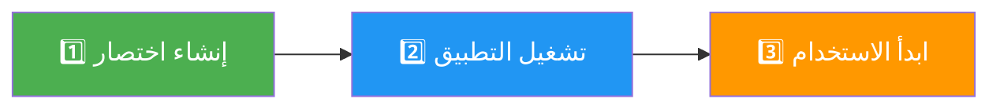
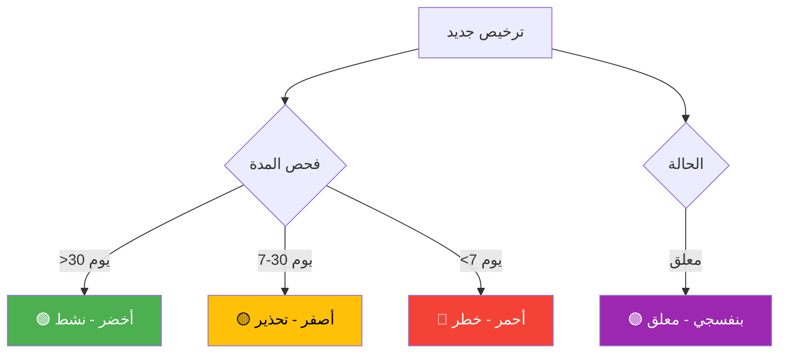

# 🎯 License Manager - المشروع مكتمل!

<div align="center">


**🎉 License Manager is Complete and Ready to Use! 🎉**

**التطبيق مكتمل وجاهز للاستخدام!**

</div>

---

## 📦 ملخص المشروع - Project Summary

### ✅ ما تم إنجازه

<table>
<tr>
<td width="50%">

#### 🖥️ التطبيق الرئيسي
- ✅ واجهة احترافية ثنائية اللغة
- ✅ 8 أوامر رئيسية
- ✅ نظام ألوان ذكي (4 ألوان)
- ✅ إحصائيات مباشرة (5 مقاييس)
- ✅ تصدير احترافي
- ✅ قاعدة بيانات JSON

</td>
<td width="50%">

#### 📚 الوثائق الكاملة
- ✅ دليل البدء السريع
- ✅ دليل المستخدم الكامل
- ✅ فهرس شامل
- ✅ ملخصات متعددة
- ✅ حل المشاكل
- ✅ نصائح وإرشادات

</td>
</tr>
</table>

---

## 🚀 البدء السريع - Quick Start

<div align="center">

### 3 خطوات فقط!



</div>

### الخطوة 1: إنشاء اختصار
```bash
انقر مرتين على: Add_License_Manager_To_Desktop.bat
```

### الخطوة 2: تشغيل التطبيق
```bash
انقر مرتين على "License Manager" في سطح المكتب
```

### الخطوة 3: ابدأ الاستخدام!
```
جرب جميع الميزات الـ 8!
```

---

## 📁 هيكل المشروع - Project Structure

```
DED/
│
├── 🖥️ التطبيق الرئيسي
│   ├── License_Manager_App.pyw          (30 KB)
│   ├── Run_License_Manager.bat          (1.4 KB)
│   └── Add_License_Manager_To_Desktop.bat (1 KB)
│
├── 💾 قاعدة البيانات
│   └── licenses.json                    (753 B)
│
└── 📚 الوثائق
    ├── README_START_HERE.md             (5.6 KB) ⭐ ابدأ من هنا
    ├── LICENSE_MANAGER_README.md        (6 KB)   📖 دليل كامل
    ├── START_HERE_LICENSE_MANAGER.txt   (8 KB)   📝 دليل سريع
    ├── 📚_INDEX.md                      (5.8 KB) 📑 فهرس شامل
    ├── 📋_FINAL_SUMMARY.txt             (11 KB)  📊 تلخيص شامل
    ├── ✅_ALL_DONE.txt                  (12 KB)  ✅ الإنجاز
    ├── 🚀_LICENSE_MANAGER_READY.md      (5 KB)   🚀 جاهز
    └── 🎯_PROJECT_COMPLETE.md           (هذا الملف)
```

---

## 🎨 الميزات الرئيسية - Main Features

<div align="center">

| # | الميزة | الوصف | الأيقونة |
|:-:|:------:|:-----:|:--------:|
| 1 | **إنشاء تراخيص** | توليد UUID فريد | ➕ |
| 2 | **البحث السريع** | بالمفتاح/الشركة | 🔍 |
| 3 | **التفعيل** | تفعيل التراخيص | ✅ |
| 4 | **التعليق** | تعليق مؤقت | ⏸️ |
| 5 | **الحذف** | حذف آمن | ❌ |
| 6 | **التحديث** | تحديث تلقائي | 🔄 |
| 7 | **الإحصائيات** | 5 مقاييس | 📊 |
| 8 | **التصدير** | تصدير احترافي | 📤 |

</div>

---

## 🎨 نظام الألوان - Color System

<div align="center">



</div>

---

## 📊 الإحصائيات - Statistics

<div align="center">

| المقياس | الوصف | الأيقونة |
|:-------:|:-----:|:--------:|
| **إجمالي التراخيص** | العدد الكلي | 📊 |
| **التراخيص النشطة** | الصالحة | ✅ |
| **التراخيص المعلقة** | المعلقة مؤقتاً | ⏸️ |
| **التراخيص المنتهية** | المنتهية | ❌ |
| **التحذيرات** | القريبة من الانتهاء | ⚠️ |

</div>

---

## 📚 الوثائق المتاحة - Available Documentation

### للمبتدئين 🌱
- **README_START_HERE.md** - ابدأ من هنا (الأفضل للمبتدئين)
- **START_HERE_LICENSE_MANAGER.txt** - دليل سريع نصي

### للمستخدمين 👤
- **LICENSE_MANAGER_README.md** - دليل كامل ومفصل
- **📚_INDEX.md** - فهرس شامل

### للمراجعة 📋
- **📋_FINAL_SUMMARY.txt** - تلخيص شامل
- **✅_ALL_DONE.txt** - ملخص الإنجاز
- **🚀_LICENSE_MANAGER_READY.md** - حالة المشروع

---

## 🔧 المتطلبات - Requirements

<div align="center">

| المتطلب | الحالة | الملاحظات |
|:-------:|:------:|:---------:|
| **Python 3.x** | ✅ مطلوب | مثبت على النظام |
| **Tkinter** | ✅ مدمج | يأتي مع Python |
| **Windows** | ✅ مطلوب | نظام التشغيل |

</div>

---

## 💡 نصائح مهمة - Important Tips

- ✅ **احفظ نسخة احتياطية** من `licenses.json` دورياً
- ✅ **راجع الإحصائيات** يومياً
- ✅ **تابع التحذيرات** (التراخيص الصفراء والحمراء)
- ✅ **استخدم التصدير** للحصول على تقارير
- ✅ **اقرأ الوثائق** قبل البدء

---

## 🎯 الخطوات التالية - Next Steps

1. ✅ اقرأ **README_START_HERE.md**
2. ✅ شغّل **Add_License_Manager_To_Desktop.bat**
3. ✅ افتح التطبيق من سطح المكتب
4. ✅ أنشئ ترخيص تجريبي
5. ✅ جرب جميع الميزات الـ 8
6. ✅ راجع الإحصائيات
7. ✅ صدّر التراخيص

---

<div align="center">

## 🎉 المشروع مكتمل بنجاح!

**Project Successfully Completed!**

---


---

**Made with ❤️ by DED Team**

**📅 2026-01-12 | 📌 v2.0.0 | ✅ Ready to Use**

---

### 🚀 ابدأ الآن!

```bash
انقر مرتين على: Add_License_Manager_To_Desktop.bat
```

</div>

